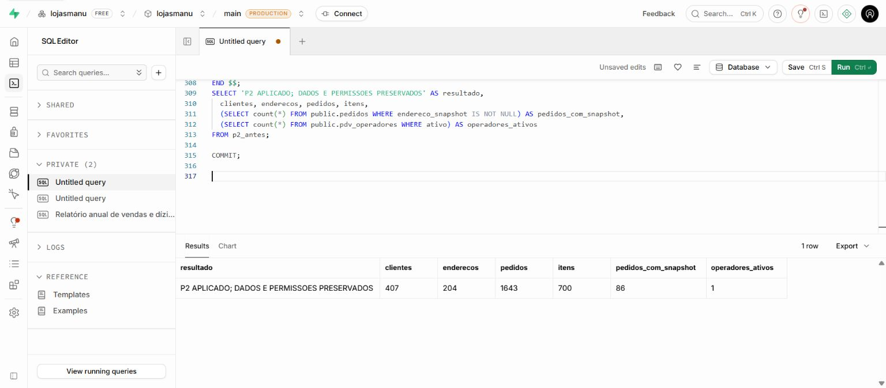

# Correções P2 — Clientes, PDV e Pedidos

Data: 01/10/2026. Referência: [relatorio.md](relatorio.md).

Os **13 achados P2 foram tratados no código**. A migração P2 foi aplicada no
Supabase lojasmanu. O código desta etapa ainda precisa ser publicado para que as
novas telas e os novos contratos entrem em produção.

## Resultado por achado

| Achado | Correção entregue | Evidência principal |
| --- | --- | --- |
| P2-01 — Limpeza de campos | Campos opcionais vazios viram `null`; campos ausentes preservam valores. Endereços retirados são desativados, sem apagar vínculos. A edição do pedido envia limpeza explícita de endereço, telefone e observação. | Testes de omissão/limpeza e rollback; edição visual do cadastro. |
| P2-02 — Inativos | Filtro Ativos/Inativos/Todos, ação e confirmação de reativação; busca inclui inativos quando necessário no histórico. | Teste de filtro/reativação; cadastro desativado, localizado e reativado no navegador. |
| P2-03 — Exportação | Escolha Página atual/Todos os filtrados; lotes de 250 com progresso, bloqueio de reenvio e conferência de contagem/IDs. Empresa e pedido usam adaptadores comuns, incluindo endereço completo. Fontes do pdfmake corrigidas. | Leitura de 1.005 registros em lotes; PDF e Excel reais com 270 linhas; PDF baixado no navegador. |
| P2-04 — Código de produto | Consulta pesquisa código e nome de maneira literal, priorizando código exato. O Autocomplete usa a classificação do servidor e retira a lista anterior enquanto aguarda a nova pesquisa. Enter de seleção não adiciona também o item por meio do atalho global. | Testes SQL de código exato, pontuação e situação; seleção local por teclado. Leitor físico não testado. |
| P2-05 — Limpar produto | `null` no Autocomplete limpa produto, cor, quantidade, preço e desconto; ação de adicionar fica indisponível. | Limpeza e nova seleção no navegador com valores reiniciados. |
| P2-06 — Endereços e histórico | Gestão de múltiplos endereços, principal explícito, índice de principal ativo único e desativação/reativação. `endereco_snapshot` preserva o endereço usado no pedido; edição e impressão consultam essa cópia. | Testes de unicidade, propriedade do endereço, rollback, cópia com campos nulos e desativação. Migração aplicada no banco real. |
| P2-07 — Volume e consultas | Clientes e produtos usam RPCs paginadas com contagem e resposta JSON agregada; endereço e compras são montados no banco. Histórico do cliente também pagina. Busca tem debounce e índices apoiam os relacionamentos. | Teste acima de mil clientes/endereços; histórico paginado; consultas novas conferidas sob RLS. |
| P2-08 — Filtros persistidos | Schema confere datas civis, UUID, enums, página e tamanho. URL/storage conservam apenas identidade mínima do cliente. Timeout é cancelado; página é ajustada após redução da lista. | Testes de URL/JSON inválidos, datas impossíveis, intervalos invertidos, defaults e serialização por ID. |
| P2-09 — Celular e tablet | É possível começar por Cliente e pagamento. Contexto permanece entre etapas; diálogo permite editar quantidade, preço e desconto no celular. Valores dos cards ficam indivisíveis, controles de data não duplicam ícones e composição é coerente em tablet. | Inspeção com dados em 390 × 844, 768 e 1024 px; item editado para preço 12/desconto 2 e subtotal 10. |
| P2-10 — Acessibilidade | Campos compartilhados têm labels e erros associados; Selects possuem `labelId`, ações de ícone têm nomes e foco permanece visível. Checkbox de exportação opera por teclado. Alvos de ícone têm 44 px. | DOM dos formulários/filtros e percurso de teclado no navegador. |
| P2-11 — Tema e movimento | Tokens válidos nos estados revisados, ações de exportação coerentes com o tema e atraso de linhas limitado a 80 ms. MotionConfig e CSS respeitam redução de movimento. | Inspeção das telas e detector mecânico `[]`. |
| P2-12 — Conexão | Indicador distingue rede, serviço e envio. Falha de Auth/consulta de permissões retorna indisponibilidade, sem tratar erro de infraestrutura como conta negada. Retry preserva o rascunho e acesso aguarda verificação. | Falha real controlada no simulador; tela de indisponibilidade; reconexão com cliente, endereço e item preservados. Teste de 503 versus acesso negado. |
| P2-13 — Regras e contratos | Clientes e cadastro rápido compartilham formulário/schema; CPF valida dígitos e normaliza, telefone aceita contato compartilhado, email normaliza e campos vazios limpam. A RPC impede novo CPF duplicado, inclusive legado/inativo, com bloqueio transacional. Routers e adaptadores de documentos têm contratos explícitos. ESLint 9 passa a executar corretamente. | Testes de CPF, duplicidade, transações, filtros, consultas, sessão e documentos; lint, TypeScript e build. |

## Validação automatizada

- `npm test`: **65 aprovados, zero falhas** — 45 de regressão e 20 da etapa P2.
- `npm run type-check`: **aprovado**.
- `npm run build`: **aprovado**, incluindo todas as rotas.
- `npm run lint`: **zero erros, 200 avisos**. Restam 149 usos de `any`, 49 avisos
  de variáveis não utilizadas e 2 de dependências de hooks no conjunto analisado.
  A execução funciona; isso não significa que todo o código legado esteja sem
  dívida técnica. Detalhes em [lint-resumo-p2.json](lint-resumo-p2.json) e
  [lint-p2.json](lint-p2.json).
- Detector da skill Impeccable: [detector-p2.json](detector-p2.json), resultado
  `[]`; o detector não certifica acessibilidade nem ausência de bugs.
- Migrações P0/P1 e P2 executadas e reaplicadas no PGlite, incluindo triggers,
  índices, transações, RLS e precisão monetária compatíveis com o schema conferido.
- O script completo de aplicação com guardas também passou no PGlite.

O build mantém avisos de metadados de navegadores desatualizados, lockfile na
pasta superior e opção de localStorage do runtime. Nenhum impediu a compilação.

## Supabase

Projeto: `lojasmanu`, referência `fuqycopmtebzypcsuzpa`.

Migração: [202610010002_p2_cadastro_consultas.sql](../../supabase/migrations/202610010002_p2_cadastro_consultas.sql).
Aplicação real: [aplicar-p2-supabase.sql](aplicar-p2-supabase.sql), gerado com a
migração e as guardas [antes](p2-antes.sql)/[depois](p2-depois.sql).

| Registro | Antes | Depois |
| --- | ---: | ---: |
| Clientes | 407 | 407 |
| Endereços | 204 | 204 |
| Pedidos | 1.643 | 1.643 |
| Itens de pedido | 700 | 700 |
| Operadores ativos | 1 | 1 |

A transação comparou fingerprints de clientes, itens, operadores e pedidos
(exceto o novo snapshot), bem como dos demais dados dos endereços. Confirmou
preservação dos valores, status, versões e datas dos pedidos e das permissões
das RPCs de escrita. A normalização de principais e a nova coluna de situação
dos endereços são alterações previstas da migração. **86 pedidos** receberam
a cópia do endereço conhecido na aplicação.

Não foram criados nem excluídos registros comerciais de teste no Supabase real.
Nenhum operador foi habilitado novamente ou teve o perfil ampliado nesta etapa.
A conta `cdjweltda@gmail.com` continua como ADMIN ativo; o verificador resolve
seu identificador atual pelo email, sem depender do ID antigo da ativação.

Resultado da aplicação: [p2-migracao-supabase.txt](p2-migracao-supabase.txt).
Consulta de validação: [verificar-p2-supabase.sql](verificar-p2-supabase.sql).
Resultado **P2 APROVADO**: [p2-verificacao-supabase.txt](p2-verificacao-supabase.txt).
O teste somente de leitura confirmou paginação de clientes/produtos sob o perfil
authenticated do ADMIN existente, preenchimento dos snapshots, bloqueio de conta
não habilitada, ausência de execução anônima e proibição de escrita direta.

## Evidências da interface

As capturas abaixo usam o servidor local com dados fictícios e um simulador
HTTP do Supabase apoiado em PGlite. Não representam vendas feitas em produção.

| Evidência | Verificação |
| --- | --- |
| [Endereços desktop](p2-enderecos-desktop.png) | Dois endereços e escolha de principal |
| [Inativos desktop](p2-inativos-desktop.png) | Cadastro encontrado após desativação |
| [Exportação desktop](p2-exportacao-desktop.png) | Escopo e seleção acessível de colunas |
| [Busca por código desktop](p2-busca-codigo-desktop.png) | Enter seleciona P1/preço 10 sem acrescentar item indevidamente |
| [Edição do item no celular](p2-editar-item-mobile.png) | Quantidade, preço e desconto disponíveis |
| [Etapa de cliente no celular](p2-pdv-cliente-mobile.png) | Acesso ao cliente antes de concluir itens |
| [Tablet 768 px](p2-pdv-tablet-768.png) / [1024 px](p2-pdv-tablet-1024.png) | Composição e tabela preenchida |
| [Filtros no celular](p2-pedidos-filtros-mobile.png) | Labels e único calendário nativo |
| [Serviço indisponível](p2-servico-indisponivel.png) | Falha diferenciada de login inválido |
| [Rascunho restaurado](p2-rascunho-restaurado.png) | Mesma venda depois do retry |

O PDF da exportação local foi posteriormente identificado em Downloads e sua
assinatura `%PDF-` foi conferida (21.253 bytes). Os testes de documento também
geraram buffers reais de PDF e arquivo Excel, com leitura posterior do workbook.
Na confirmação final da busca, Enter imediato durante uma consulta sem resultado
não selecionou a lista anterior. Após pesquisar P1, Enter selecionou o produto
correto e manteve a quantidade de itens do carrinho; registro em
[p2-busca-codigo.json](p2-busca-codigo.json).

## Limites e publicação

- Pedidos antigos recebem o endereço conhecido na migração. Não há como recuperar
  automaticamente dados originais já sobrescritos antes dela.
- CPFs legados duplicados não são mesclados automaticamente; novos conflitos
  recebem mensagem para localizar o cadastro existente. Telefone não é único.
- A exportação detecta divergência de contagem, IDs repetidos e truncamento entre
  lotes; não cria uma transação de leitura única envolvendo toda a exportação.
- A venda offline continua como rascunho. Não foi prometida nem implementada
  sincronização automática de pedidos em uma fila offline.
- Não foi feito benchmark com grande volume em produção, uso de leitor físico
  de código ou certificação completa por leitor de tela/WCAG. A validação móvel
  usou as larguras e ações descritas acima.
- Os fluxos visuais foram exercitados no simulador. No banco real, a aplicação
  da migração e as verificações são separadas dos testes comerciais locais.

**Próximo passo:** publicar este código. A migração já está aplicada e preserva
os contratos antigos para permitir essa transição. Após o deploy, conferir
Clientes, seleção de endereço no PDV e reimpressão de um pedido pela aplicação
publicada, com a conta ADMIN autorizada.
