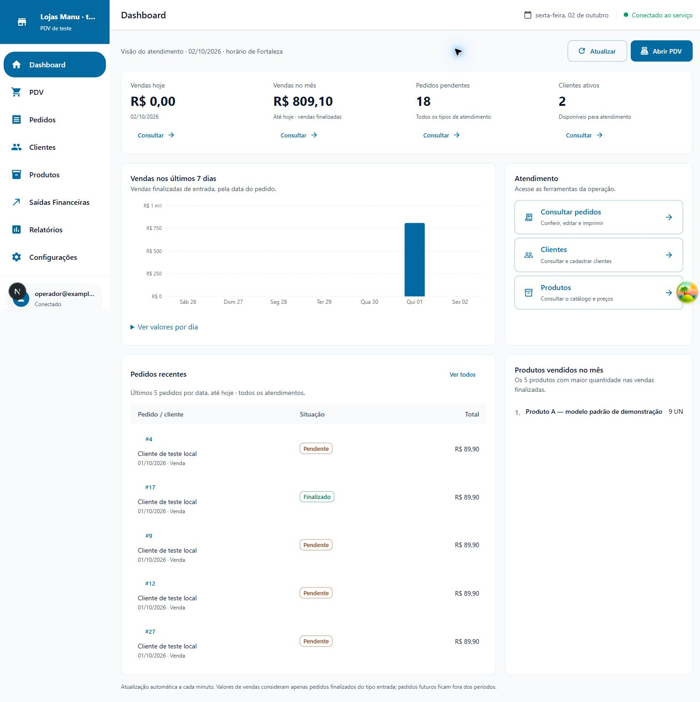
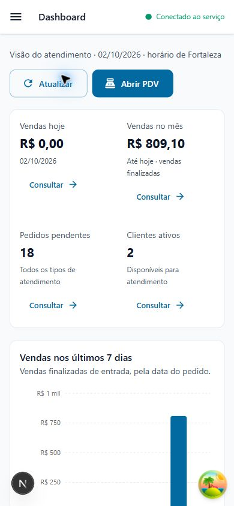

# Dashboard — análise e correções

Data: 02/10/2026. Escopo: página inicial, consulta `relatorios.dashboard`, links para pedidos e componentes utilizados nessa tela. Revisão orientada pelo Impeccable, preservando a identidade azul e o padrão operacional já adotado. Implementação local, sem publicação ou alteração do Supabase de produção.

## Problemas encontrados e resolvidos

| Prioridade | Problema | Correção |
|---|---|---|
| P1 | Percentuais de crescimento fixos exibidos como indicadores reais | Removidos; não havia cálculo nem período de comparação que sustentasse os números. |
| P1 | Vendas/itens sujeitos ao limite de linhas da API | Pedidos e itens consultados em páginas de 250, com contagem e identificação conferidas; lotes de até 50 pedidos por consulta de itens. |
| P1 | Consultas com erro aparentavam ausência de vendas, pedidos ou produtos | Falhas propagadas. Carregamento, vazio, indisponibilidade e falha de atualização agora têm estados distintos. Dados anteriores permanecem acompanhados de aviso. |
| P1 | Mês e semana podiam incluir pedidos futuros; horário do servidor e navegador podia mudar o dia | Períodos limitados até hoje, com calendário único de America/Fortaleza enviado pelo servidor. |
| P2 | Ranking de produtos dependia de RPC não definida no projeto e sem tratar erro | Ranking explícito dos produtos de vendas finalizadas de entrada no mês; soma por ID do produto, preservando unidades e frações. |
| P2 | Cartões e linhas clicáveis sem acesso equivalente pelo teclado | Links reais nos atalhos, indicadores e números dos pedidos; foco e ativação padrão pelo teclado. |
| P2 | Atalhos chamavam cadastro mas abriam consultas | Texto descreve o destino real: Clientes, Produtos e Consultar pedidos. |
| P2 | Filtros recebidos do dashboard não eram aplicados sem marcador de retorno da edição | Hook reconhece parâmetros `filtro_*` e aplica os filtros correspondentes. |
| P2 | Gráfico sem moeda no eixo e sem alternativa textual dos valores | Eixo/tooltip em reais, sete dias fornecidos pelo servidor, tabela diária expansível e acessibilidade do gráfico. |
| P2 | Hierarquia visual excessiva, cores competindo, movimentos no hover e ação flutuante duplicada | Resumo compacto, painéis com bordas discretas, tipografia consistente, ação Abrir PDV no topo e links sem transformações decorativas. |
| P2 | Cabeçalho do dashboard sem h1 e proteção de rota duplicada | Título existente do topbar recebe h1; página utiliza a proteção central do aplicativo. Sem repetir título no corpo. |

Nenhum P0 foi identificado no escopo revisado. Esta revisão não substitui uma auditoria integral dos demais relatórios ou módulos.

## Critérios dos indicadores

- Vendas hoje/mês/semana: soma do total de pedidos FINALIZADO com tipo de atendimento ENTRADA, pela data civil do pedido (`pedidos.data`). O total incorpora os descontos já gravados. Não foi alterado para a data de finalização.
- Mês: do primeiro dia até hoje. Semana: hoje e os seis dias anteriores, inclusive na virada do mês.
- Pendentes: todos os tipos de atendimento, inclusive pedidos agendados. Clientes: somente ativos.
- Pedidos recentes: cinco registros por data do pedido, até hoje, de todos os tipos. Empates seguem a ordenação estável da RPC existente por ID; não representam ordem de criação dentro do dia.
- Produtos: cinco maiores quantidades por produto nas vendas finalizadas de entrada do mês. Unidades diferentes não são convertidas; a unidade acompanha cada quantidade. Trata-se de ranking por quantidade, não por faturamento ou margem.
- Atualização manual e automática a cada minuto; os valores não são uma transmissão em tempo real.

## Validação

- `npm test`: **86 testes aprovados**, incluindo cinco novos testes de dashboard.
- Novos cenários: virada de dia UTC/Fortaleza e ano bissexto; mês/semana; exclusão de futuro, saída e pendente das vendas; soma de centavos; clientes ativos; mais de mil pedidos; mais de 250 itens; produtos com mesmo nome e IDs distintos; quantidades fracionárias; propagação de falhas; filtros vindos dos atalhos.
- `npm run type-check`: aprovado.
- `npm run lint`: zero erros, 176 avisos existentes em outros trechos do projeto. Os arquivos novos do dashboard não introduziram avisos.
- `npm run build`: aprovado. Permanecem avisos de metadados de compatibilidade de navegadores desatualizados.
- Chrome local com banco sintético: R$ 809,10 no mês, 18 pendentes, 2 clientes ativos e 9 UN do produto A, coerentes com a fixture.
- Link de pendentes ativado por Enter: consulta mostrou 18 pedidos pendentes. Número de pedido abriu os detalhes corretos.
- Tabela diária revelou os sete valores do gráfico, incluindo R$ 809,10 em 01/10.
- Falha de conexão simulada: aviso de última consulta, sem trocar valores por zero; Atualizar recuperou a consulta após restauração.
- Desktop e viewport móvel de 390 × 844: hierarquia legível, estados dos pedidos mantidos e sem transbordamento horizontal da página. Sem erros capturados no console do navegador.

## Limites e próximos passos

Não é necessária nova migração: a implementação utiliza as RPCs protegidas de listagem e estatísticas já presentes nas migrações P0/P1/P2. A publicação continua pendente.

A paginação elimina truncamentos, mas a leitura não constitui um snapshot transacional entre todas as consultas. Alterações de contagem/IDs durante a paginação geram falha e permitem nova tentativa; alterações simultâneas que preservem contagem podem aparecer em instantes diferentes. Em lojas com volume mensal muito alto, convém evoluir para uma RPC agregadora dedicada no banco e medir o custo das consultas antes de aumentar a frequência de atualização.

Percentuais comparativos só devem retornar após definir períodos equivalentes e calcular a comparação real. O dashboard não representa caixa recebido, margem ou lucro.

## Evidências visuais

