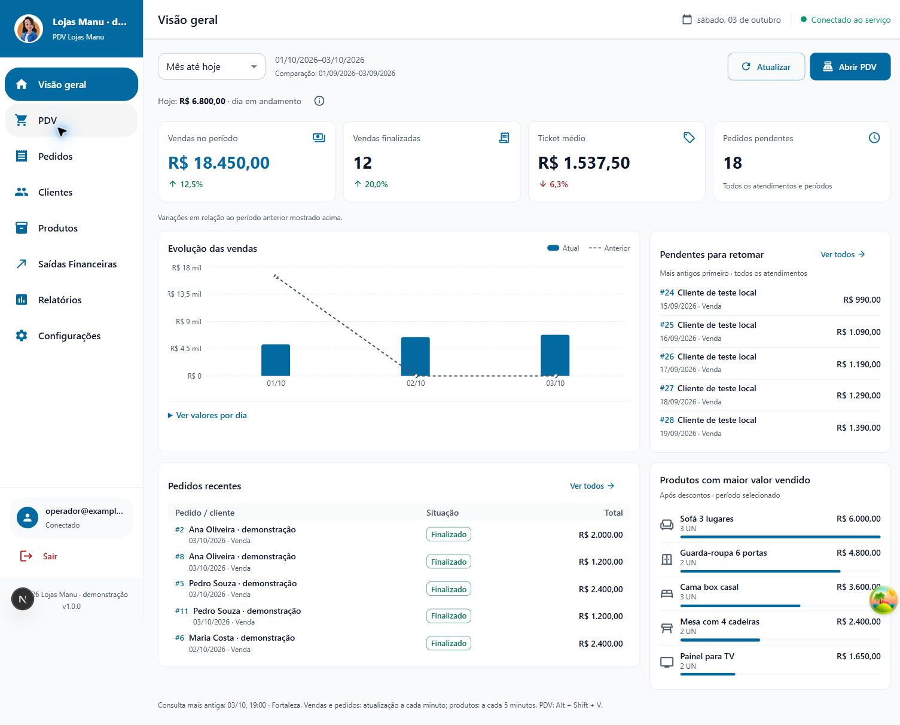
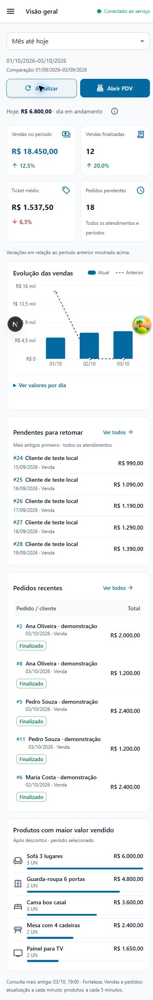

# Dashboard — evolução visual e inteligência comercial

As propostas desktop e móvel foram aprovadas pelo usuário em 03/10/2026 (“aprovo”). A implementação mantém a identidade azul e o layout global, com foco em vendas e operação para ADMIN e operadores.

## Comportamento entregue

- Seletor Mês até hoje (padrão), Últimos 7 dias e Últimos 30 dias.
- Quatro cards: valor das vendas, quantidade de vendas finalizadas, ticket médio e total global de pedidos pendentes. Os três primeiros acompanham o seletor; os pendentes abrangem todos os atendimentos/períodos.
- Vendas de hoje em contexto compacto; comparações com seta, percentual, texto acessível e ajuda com valor anterior disponível por teclado.
- Gráfico amplo com barras atuais e linha anterior tracejada, tooltip com datas dos dois períodos e tabela dos valores. Dias sem vendas aparecem com zero; dia inexistente no mês comparativo fica sem valor.
- Cinco pendentes mais antigos, cinco pedidos recentes e cinco produtos com maior valor líquido vendido, com quantidade/unidade e barras proporcionais.
- Ícones de móveis da biblioteca já instalada, logotipo existente e nenhuma nova imagem na interface. Sem dados demonstrativos ou avisos de prévia na aplicação publicada.
- Links dos indicadores aplicam filtros de status, tipo e datas na página de pedidos. Alt + Shift + V continua abrindo o PDV.

## Critérios e contratos

Somente FINALIZADO + ENTRADA entra em vendas. Os totais usam a data civil do pedido e o calendário de Fortaleza; descontos já gravados são preservados. O painel não mede recebimentos em caixa, lucro ou margem.

Mês até hoje compara com o mesmo trecho do mês anterior, limitado ao último dia existente. Ambos os intervalos ficam visíveis; meses com comprimentos diferentes podem ter quantidades de dias diferentes. Janelas de 7/30 dias comparam com os intervalos imediatamente anteriores de igual duração. Hoje permanece em andamento.

Percentuais usam apenas base anterior positiva. Base zero ou negativa produz Sem base comparável, sem fabricar crescimento. Valores negativos históricos conservam o sinal. Venda de total zero continua sendo uma venda finalizada; o estado vazio depende da quantidade de pedidos, não da soma.

Novas consultas protegidas: relatorios.dashboardDesempenho (período validado) e relatorios.dashboardProdutosPeriodo (datas civis validadas). Os endpoints antigos estão preservados. O ranking reutiliza consultarPeriodoFinanceiro, incluindo rateio em centavos do desconto geral, SKUs distintos e informação de vendas sem itens detalhados.

Resumo, pendentes e recentes carregam independentemente do ranking. O ranking inicia após as seções essenciais e usa chave de cache por datas. A troca de período não mostra resultados do período anterior enquanto carrega. Atualização manual; automática a cada minuto nas seções essenciais e a cada cinco minutos no ranking. Falhas identificam a última consulta mantida e permitem nova tentativa na seção.

Não há migração, alteração de permissões, mudança de relatório/impressão ou novos indicadores de estoque, margem, metas, conversão ou entregas.

## Validação

- Suíte completa: 118 testes passaram na primeira execução. Foi acrescentado depois um teste de autorização; a execução final dos testes de dashboard passou em 14 cenários, incluindo os sete novos.
- Tipos: aprovado após os ajustes finais.
- ESLint dos arquivos alterados: sem erros ou avisos. Lint geral: sem erros, com 62 avisos existentes fora desta mudança.
- Detector Impeccable do dashboard: nenhum achado.
- Testes cobrem meses curtos, ano bissexto, virada de data/ano de Fortaleza, janelas móveis, exclusão de outros tipos/situações/futuro, centavos, totais negativos, base não positiva, mais de mil vendas, rateio de descontos, SKU/unidade, falhas e autorização.
- Chrome local com banco sintético: R$ 18.450,00 em 12 vendas, ticket R$ 1.537,50; anterior R$ 16.400,00 em 10 vendas. Variações 12,5%, 20,0% e -6,3%. Ranking R$ 6.000,00 / 4.800,00 / 3.600,00 / 2.400,00 / 1.650,00, com proporções 100% / 80% / 60% / 40% / 27,5%.
- Seletor conferido nos três períodos; a tabela comparativa revelou os valores por dia. Indicador de vendas ativado por Enter abriu 12 pedidos finalizados de Venda nas datas correspondentes, total R$ 18.450,00.
- Atalho do PDV conferido. Falha isolada dos itens manteve resumo/filas; falha geral manteve dados anteriores identificados; restauração recuperou a consulta. Estado vazio exibe zero real e Sem base comparável.
- Desktop no enquadramento da proposta, viewport normal de 1528 px e móvel com override 390 × 844 (largura efetiva capturada de 382 px): nenhum transbordamento horizontal nas verificações de DOM. Título apenas no topbar, grades reorganizadas, situações legíveis no celular.
- Console sem erros na captura final saudável. Capturas vêm de desenvolvimento, com ferramentas globais Next.js/TanStack visíveis; essas ferramentas não integram o novo dashboard.

Build de produção aprovado. Revisão visual independente Impeccable: **ship**, sem correções materiais pendentes, comparando a implementação com as imagens aprovadas, o design existente e as capturas de desktop, celular, vazio e falha. A captura comparativa nativa tem 1513 × 1039 px, iguais à proposta desktop; foi necessário recapturá-la para corrigir o enquadramento.

A revisão não teve uma referência QUALITY BAR separada nem testes próprios ao vivo de teclado/leitor de tela. A conferência de teclado registrada acima foi executada localmente durante a implementação; não constitui uma auditoria completa de leitor de tela.

## Evidências

Todas as capturas usam dados sintéticos, identificados na empresa como demonstração. Nenhuma consulta ou alteração em dados da loja foi feita.

Estados adicionais: vazio-mobile.jpg e falha-mobile.jpg na mesma pasta; hero-repro.jpg guarda o enquadramento comparativo e user-1528.jpg a tela no viewport normal.

## Limites

Consultas paginadas completas não constituem snapshot transacional entre todas as seções. Alterações simultâneas podem produzir horários distintos, por isso o painel informa a consulta mais antiga e identifica falhas. Para volumes muito altos, uma agregação dedicada no banco pode reduzir o custo; esta etapa mantém as consultas protegidas existentes e não cria migração.

Publicação, commit e push não realizados nesta etapa.
