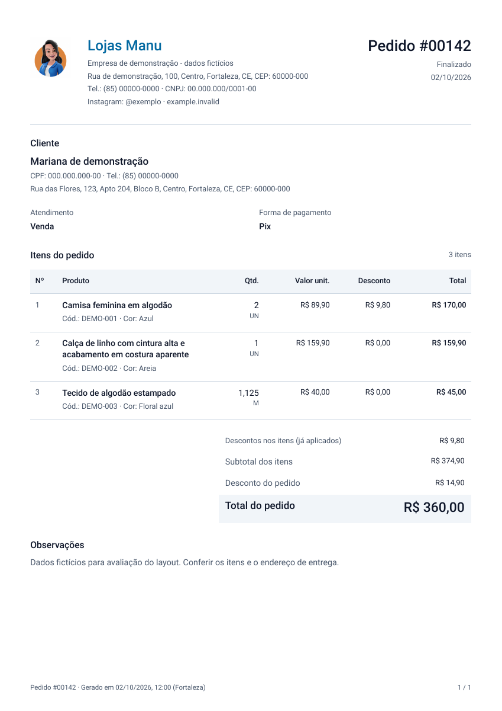
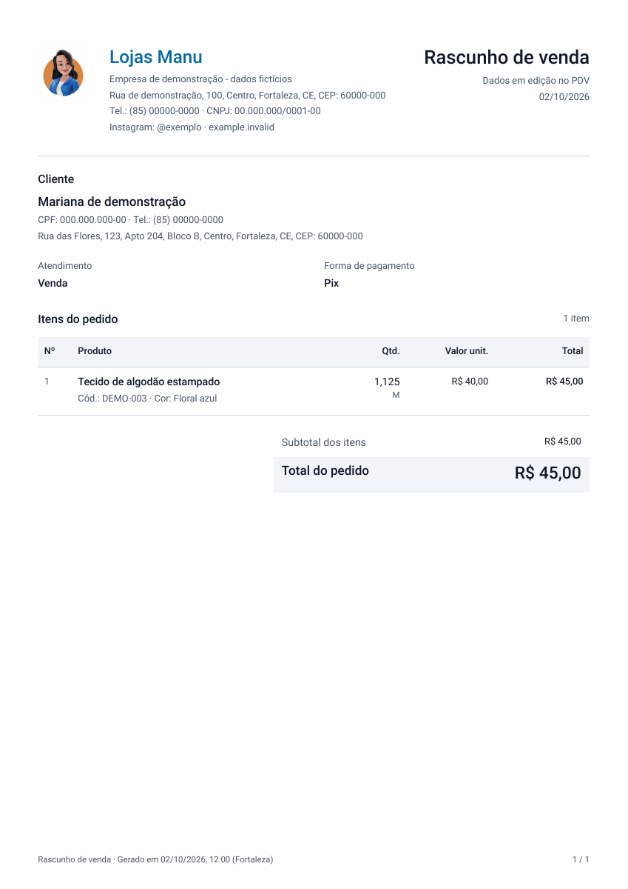

# PDF e impressão de pedidos - revisão e refinamento

Data: 02/10/2026. Escopo implementado: documento individual de pedido, rascunho do PDV e fluxo de impressão/download da página de pedidos. Identidade preservada: azul #0369a1, Roboto, fundo branco e hierarquia operacional. PDF A4 com margens de 36 pontos; documento e impressão usam a mesma definição.

## Achados e correções

| Prioridade | Achado | Resultado |
|---|---|---|
| P1 | Na página de pedidos, a janela era criada após a busca assíncrona dos dados, sujeita ao bloqueador de pop-ups | A janela é reservada no clique, antes da consulta/importação, usando o mesmo mecanismo do PDV. Em caso de falha, ela é fechada e o erro aparece ao operador. |
| P1 | Rascunho podia parecer um pedido salvo e situação/tipo de atendimento não apareciam | Rascunho identificado como dados em edição; pedido salvo traz número e situação quando disponíveis. Tipo de atendimento fica explícito. |
| P1 | Logo sem conferir resposta HTTP, tipo, tamanho ou erro de leitura podia quebrar a geração | Carregamento protegido: limite de tempo de rede, PNG/JPEG de até 2 MB e validação da imagem. Sem logo configurado, usa o ícone padrão da aplicação. Logo inválido/indisponível é omitido sem impedir o documento. |
| P2 | Empresa/endereço/contatos pequenos, excesso de grades e descrição comprimida | Cabeçalho com logo proporcional, marca, identificação e data. Dados agrupados, fontes mais legíveis, linhas horizontais discretas e maior espaço para produto. |
| P2 | Código do produto não aparecia; cor usava S/N mesmo ausente; quantidade sem unidade/formatação local | Código e cor aparecem abaixo do produto quando existem. Quantidade em pt-BR com até três casas; unidade preservada no carrinho e enviada ao documento. Dados ausentes não recebem unidade inventada. |
| P2 | Desconto de item e desconto geral pouco distinguíveis | Coluna de desconto só aparece quando necessária. Resumo separa descontos nos itens já aplicados do desconto geral do pedido; subtotal e total permanecem os valores do pedido, sem dupla subtração. |
| P2 | Forma de pagamento apresentada como Pagar, sugerindo cobrança sem evidência do recebimento | Campo neutro Forma de pagamento; nenhuma afirmação de pagamento recebido. |
| P2 | Observação vazia ocupava área e gerava linhas desnecessárias | Seção exibida somente quando preenchida. Mantém quebras de linha e permite observações extensas. |
| P2 | Impressão extensa sem identificação recorrente suficiente | Número e empresa no cabeçalho de continuação, cabeçalho da tabela repetido, totais agrupados e páginas numeradas. |
| P2 | Documento vazio, data inválida ou valores não finitos podiam chegar ao gerador | Validação impede emissão e orienta conferir data, quantidades e valores. Não altera os dados gravados. |

Nenhum P0 identificado neste escopo. A exportação de listas de pedidos permanece um relatório de consulta; esta implementação refina o documento individual entregue na venda.

## Composição do documento

1. Empresa à esquerda; pedido/rascunho, situação e data à direita.
2. Cliente, contato e endereço completo do pedido; não substitui endereço ausente pelo principal do cadastro.
3. Tipo de atendimento e forma de pagamento.
4. Tabela com produto, código/cor, quantidade/unidade e valores alinhados à direita.
5. Resumo financeiro com total destacado em fundo claro, preservando legibilidade em preto e branco.
6. Observações quando preenchidas e rodapé de geração/paginação.

A data do pedido permanece civil, sem deslocamento UTC. Horário de geração explicitamente em America/Fortaleza. O número não é atribuído a rascunhos novos; rascunhos de edição mantêm a referência do pedido e a indicação de edição.

## Validação

- `npm test`: **91 testes aprovados**, incluindo cinco novos cenários de PDF de pedido e os cinco de impressão existentes.
- `npm run type-check`: aprovado.
- `npm run lint`: zero erros; 175 avisos preexistentes em outros trechos. Removido o uso de any na definição do PDF individual.
- `npm run build`: aprovado. Avisos de metadados de compatibilidade de navegadores permanecem.
- PDFs reais produzidos com o pdfmake utilizado pela aplicação; renderizados com Poppler para inspeção visual conjunta de pedido comum, rascunho, continuação e última página.
- Exemplo comum e rascunho: uma página A4 cada. Exemplo extenso: 65 produtos com descrições longas e observações extensas, oito páginas. Códigos de todos os produtos e total conferidos por extração do PDF.
- Cabeçalho de continuação conferido também por coordenadas do renderizador: y=20 pontos, dentro da página; corpo e rodapé não disputam a mesma área nos exemplos.
- Logo preserva proporção, quantidade fracionária permanece 1,125 M e desconto do pedido não é confundido com os descontos já aplicados nos itens.

## Limites

Verificação realizada sobre arquivos e testes de geração/fluxo. Não houve impressão física em impressora da loja nem acionamento do diálogo nativo de impressão nesta etapa. Driver, margens da impressora e escala escolhida podem afetar o resultado; o layout é A4, não uma versão de bobina térmica.

Dados dos exemplos são fictícios e identificados como demonstração. Unidade e informações do produto seguem os dados disponíveis; rascunhos antigos podem não ter unidade armazenada. O documento não acrescenta condições comerciais, assinatura, dados fiscais ou alegações de pagamento que o sistema não possui.

Mudanças locais, sem commit, push ou publicação nesta etapa. Nenhuma migração necessária.

## Artefatos para revisão

- `output/pdf/pedido-exemplo.pdf`
- `output/pdf/rascunho-exemplo.pdf`
- `output/pdf/pedido-multiplas-paginas.pdf`
- Regeneração: `node scripts/preview-pedido-pdf.cjs` (somente dados sintéticos).

