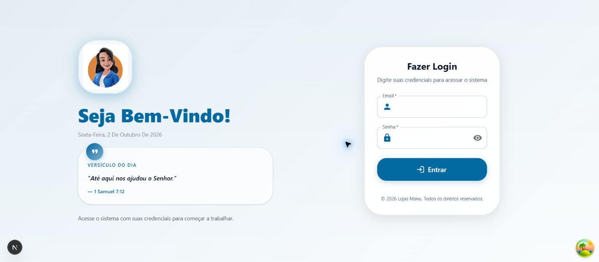
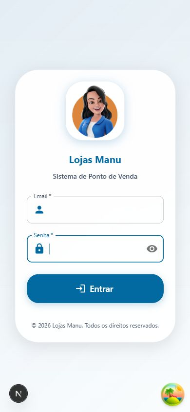

# Revisão e correções do login — 02/10/2026

| Achado | Correção |
| --- | --- |
| O login dependia de `logo_url` das configurações autenticadas; antes de entrar recebia undefined e exibia a letra L | Identidade pública da Lojas Manu com `/icon-512x512.png`, exibida em desktop e mobile sem consultar configurações protegidas |
| Tela de espera fixa de 1 segundo e animação de sucesso com espera de 3,5 segundos | Formulário aparece diretamente; autenticação autorizada redireciona sem espera artificial |
| Redirecionamento usava push e não aguardava explicitamente a verificação real da sessão | Aguarda o estado de autenticação e usa replace, com proteção contra redirecionamentos repetidos |
| Envio dependia somente do estado React e não tratava exceções na página | Guarda síncrona contra envio concorrente; try/catch/finally libera a interface após falhas |
| Controle de senha sem nome acessível e campos sem identificação completa para preenchimento automático | Mostrar/Ocultar senha com estado anunciado, foco preservado, type button; IDs, nomes, required e autocomplete corretos |
| Erros temporários não tinham recuperação direta pela sessão existente | Botão Verificar sessão reutiliza a sessão após o serviço recuperar; mensagens específicas de indisponibilidade preservadas |
| Limpeza de flags antigas acessava localStorage sem proteção | Falha de armazenamento não interrompe a inicialização da autenticação |
| Versículo calculado pela diferença de horas desde janeiro e módulo fixo de 120 | Contagem de dias civis, suporte a anos bissextos e ciclo pelo tamanho real da lista; data/versículo calculados após hidratação para acompanhar o calendário local |
| Decoração com animação contínua e ramos duplicados de monograma | Movimento contínuo e ramos mortos removidos; estrutura visual, textos e disposição do login preservados |

A imagem é a original fornecida para o PWA, já exportada no projeto. Nome e identidade da tela pública são estáveis; configurações privadas da empresa continuam nos módulos autenticados e nos documentos.

## Validação

- 81 testes passaram, incluindo três novos testes do calendário diário (hora, ano bissexto e horário de verão).
- Tipos, build de produção e lint dos arquivos envolvidos passaram.
- Chrome desktop: imagem carregada com largura natural de 512 pixels e h1 do formulário presente.
- Chrome com viewport 390 × 844: imagem carregada; largura do documento 390, sem rolagem lateral.
- Campos obrigatórios impedem envio vazio e posicionam o foco no email.
- Mostrar/Ocultar senha altera o tipo do campo, mantém o foco e não envia o formulário.
- Credenciais inválidas em conta sintética exibiram erro e liberaram os campos para nova tentativa.
- Falha 503 simulada na verificação de permissões preservou o formulário e ofereceu Verificar sessão. Após restaurar o serviço, o botão reutilizou a sessão e abriu o dashboard.
- Saída da conta sintética retornou ao login. Não foram detectados erros de imagem, hidratação ou exceções React no fluxo verificado.

As interações usaram exclusivamente o simulador local do Supabase e uma conta sintética. A verificação visual foi feita no ambiente de desenvolvimento; o build real foi validado separadamente. Não houve publicação nesta etapa.

