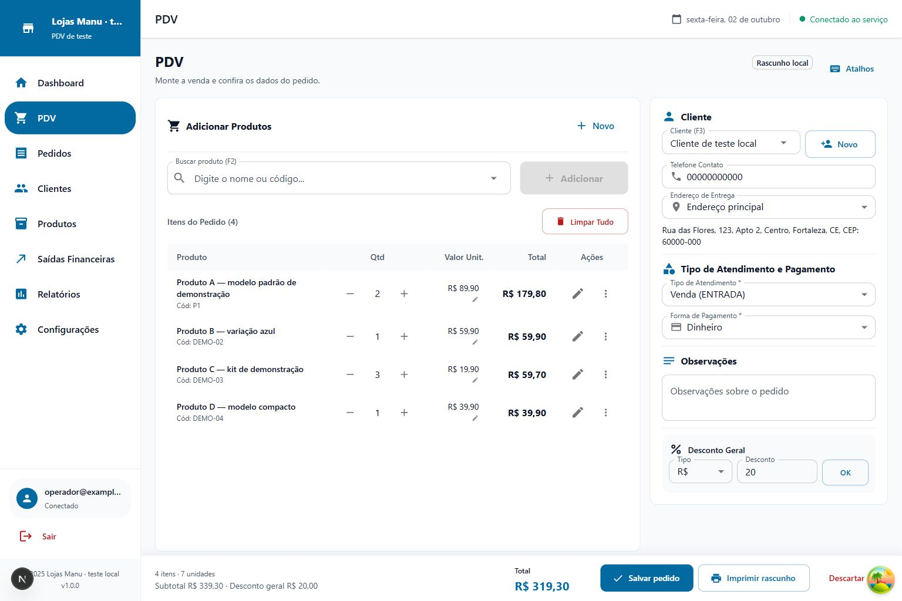
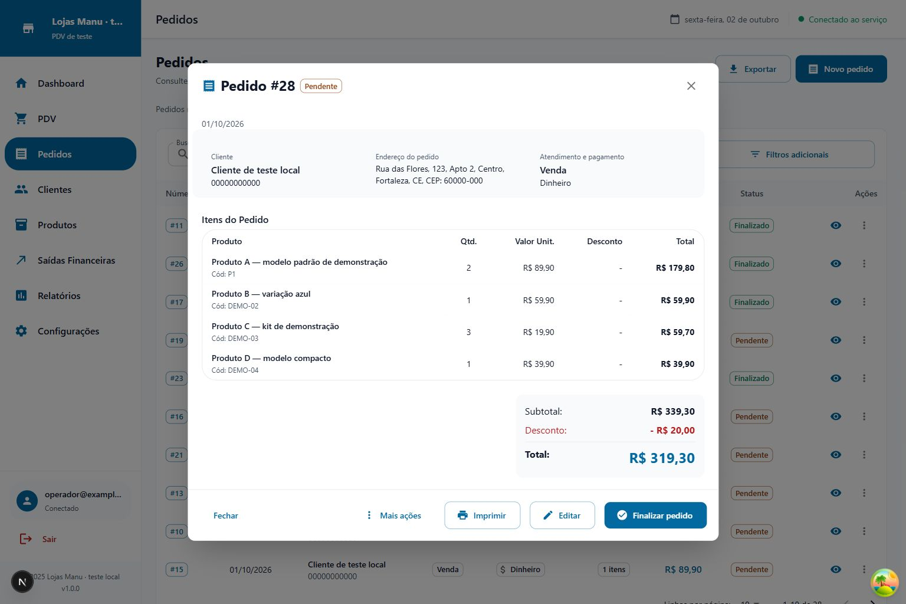
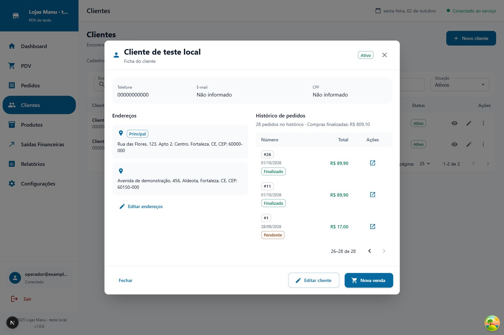

# Implementação dos refinamentos de PDV, Pedidos e Clientes

Entrega local conferida em 02/10/2026, seguindo as três composições C aprovadas e a identidade azul/MUI. O foco continua sendo atendimento no computador com teclado e mouse.

## O que mudou

- **PDV:** duas áreas, carrinho amplo, contexto da venda aberto no computador, endereço completo separado do seletor, total e salvar persistentes. Preço, quantidade, desconto, cor e duplicação continuam disponíveis. A conferência explica que o pedido será salvo como Pendente; o sucesso permite abrir o pedido ou começar outra venda.
- **Pedidos:** indicadores compactos, busca e situação acessíveis, filtros adicionais progressivos, tabela com ações por status/permissão. A janela reúne cliente, endereço histórico, atendimento e pagamento; itens e financeiro destacado à direita. O indicador monetário se chama “Vendas finalizadas na consulta”, acompanhando o critério da RPC.
- **Clientes:** busca e situação compactas, ficha em janela de até 900 px, contato distribuído, todos os endereços e histórico paginado. Data e status ficam junto ao número para manter as ações acessíveis em larguras menores. Nova venda valida o cliente ativo e pede confirmação se houver rascunho a descartar. Os endereços no cadastro possuem expansão progressiva, conservando os campos estruturados.
- **Componentes:** hierarquia e superfícies operacionais compartilhadas, foco visível, badges semânticos, ícones MUI, menor movimento decorativo e navegação com indicação da página atual.

## Validação

Build de produção e verificação de tipos passaram depois da rodada de correções. A implementação passou pelos 65 testes existentes. Lint terminou sem erros, com 192 avisos do projeto. O detector visual rodou uma vez nos nove alvos e retornou lista vazia. Não houve atualização de dependências.

A verificação de navegador usou exclusivamente um simulador Supabase local com dados fictícios, habilitado por `PDV_UX_FIXTURE=1`; ele não integra o fluxo de produção. Foram conferidos:

- Quatro itens, sete unidades, subtotal R$ 339,30, desconto geral R$ 20,00 e total R$ 319,30; gravação do pedido #28 como Pendente e reabertura dos quatro itens com endereço completo.
- Desconto geral integralmente visível acima do rodapé em 1536 × 1024; áreas empilhadas em 1024 e etapas no celular.
- Cancelar a troca para nova venda preserva o rascunho; cliente inativo tem Nova venda desabilitada.
- Histórico com 25 registros na primeira página e três na segunda, total real de 28.
- Filtro Pendente com 19 pedidos e R$ 0,00 em vendas finalizadas; limpar filtros com Enter retorna 28 pedidos e R$ 809,10.
- Ficha móvel com `clientWidth=scrollWidth=390` e tabela sem rolagem lateral. Listas de Pedidos e carrinho também foram conferidas em 390 px.

As capturas estão em `.impeccable/review/`. A rodada final utilizou recorte explícito do viewport para evitar que o navegador embutido truncasse a imagem à altura física do painel. Elementos flutuantes de desenvolvimento/ambiente não pertencem à interface de produção.

## Revisão independente

A primeira revisão encontrou cinco ajustes materiais: densidade do PDV, agrupamento/título/total do pedido, largura/título/contato da ficha, rótulo financeiro e ícones dos avisos. Eles foram tratados em uma única rodada; o resultado é registrado em `.impeccable/review/finish-verdict.md`.

**Veredicto final: `ship` no escopo das cinco correções, todas pontuadas como resolvidas.** A evidência complementar `pdv-atalhos.png`, `pdv-atalho-cadastro.png` e `pedidos-filtros-restaurados.png` comprova os quatro avisos transitórios com ícones MUI. Esse resultado não representa certificação de todos os estados do sistema.

O agente da primeira revisão encerrou na retomada da sessão. A passagem de veredicto foi feita em novo contexto independente, recebendo a mesma lista e as novas capturas; seu escopo é resolver esses cinco achados, sem certificar todos os estados da aplicação.

O padrão visual construído está registrado em [DESIGN.md](../../DESIGN.md), com decisões específicas nos briefs das três superfícies. Ele descreve o código implementado e conserva o histórico das aprovações.

## Limites da entrega

Sem certificação WCAG, teste com leitor de tela ou benchmark de produção. A impressão em navegador não foi repetida nesta rodada visual; os testes existentes incluem geração de documentos. Nenhuma migração ou alteração no Supabase real foi necessária.

A implementação já consta no commit local `9fb07c3`, encontrado na retomada. Esta conclusão acrescenta capturas atualizadas, revisão e documentação; não executa novo commit, push ou publicação.

